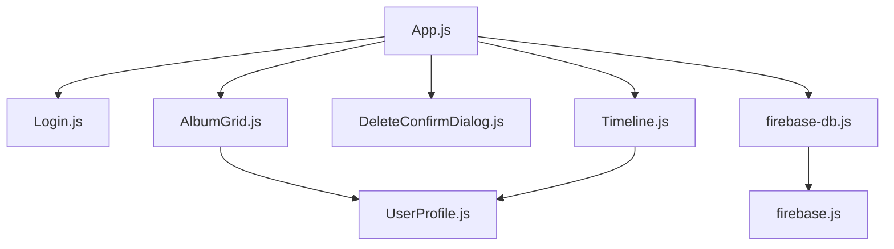

# Coral Growth Tracker - Project Structure

## Core Files
- `src/App.js` - Main application component
- `src/index.js` - Application entry point
- `src/firebase.js` - Firebase configuration and initialization

## Components
- `src/components/Login.js` - User authentication component
- `src/components/SignUp.js` - User registration component with first name field
- `src/components/Timeline.js` - Photo timeline display component
- `src/components/AlbumGrid.js` - Album overview grid component
- `src/components/DeleteConfirmDialog.js` - Confirmation dialog for deletions
- `src/components/UserProfile.js` - User profile display component with avatar

## Services
- `src/services/firebase-db.js` - Firebase service methods (auth, storage, firestore, user profiles)

## Configuration
- `package.json` - Project dependencies and scripts
- `.env` - Environment variables (Firebase config)

## Component Relationships

## Database Collections
- `albums` - User photo albums
- `userProfiles` - User profile information including first names